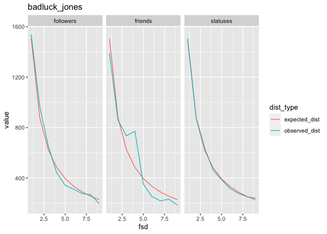

<!-- README.md is generated from README.Rmd. Please edit that file -->

# totervogel 

<!-- badges: start -->

<!-- badges: end -->

The goal of totervogel is to detect malicious twitter accounts using
Benford’s Law.

Please refer to Golbeck (2015) and Golbeck (2019) for more details.

1.  Golbeck, J. (2015). Benford’s law applies to online social networks.
    PloS one, 10(8), e0135169. doi:
    [10.1371/journal.pone.0135169](https://doi.org/10.1371/journal.pone.0135169)
2.  Golbeck, J. (2019). Benford’s Law can detect malicious social bots.
    First Monday. doi:
    [10.5210/fm.v24i8.10163](https://doi.org/10.5210/fm.v24i8.10163)

## Installation

You can install the development version of totervogel from
[GitHub](https://github.com/) with:

``` r
# install.packages("devtools")
devtools::install_github("chainsawriot/totervogel")
```

## Example

This is how my totervogel looks like:

``` r
library(totervogel)
res <- create_totervogel("chainsawriot")
res
#> User ID: chainsawriot 
#> Friends Correlation:  0.9931321 
#> Friends MAD:  0.007438397 ( Acceptable conformity )
#> Statuses Correlation: 0.9909444 
#> Statuses MAD:  0.01188518 ( Acceptable conformity )
#> Followers Correlation:  0.9949865 
#> Followers MAD:  0.006927456 ( Acceptable conformity )
```


This is how a potentially malicious twitter account’s totervogel looks
like:

(Please don’t visit the account.)

``` r


malicious_res <- create_totervogel("badluck_jones")
malicious_res
#> User ID: badluck_jones 
#> Friends Correlation:  0.9554649 
#> Friends MAD:  0.01745583 ( Nonconformity )
#> Statuses Correlation: 0.9995705 
#> Statuses MAD:  0.002277119 ( Close conformity )
#> Followers Correlation:  0.9965788 
#> Followers MAD:  0.007197219 ( Acceptable conformity )
```

``` r
plot(malicious_res)
```



``` r
malicious_res$friends_benford
#> 
#> Benford object:
#>  
#> Data: info$friends_count 
#> Number of observations used = 5000 
#> Number of obs. for second order = 3319 
#> First digits analysed = 1
#> 
#> Mantissa: 
#> 
#>    Statistic  Value
#>         Mean  0.500
#>          Var  0.075
#>  Ex.Kurtosis -1.056
#>     Skewness -0.063
#> 
#> 
#> The 5 largest deviations: 
#> 
#>   digits absolute.diff
#> 1      4        281.45
#> 2      1        114.15
#> 3      3        111.31
#> 4      6         82.73
#> 5      7         68.96
#> 
#> Stats:
#> 
#>  Pearson's Chi-squared test
#> 
#> data:  info$friends_count
#> X-squared = 243.1, df = 8, p-value < 2.2e-16
#> 
#> 
#>  Mantissa Arc Test
#> 
#> data:  info$friends_count
#> L2 = 0.0083259, df = 2, p-value < 2.2e-16
#> 
#> Mean Absolute Deviation (MAD): 0.01745583
#> MAD Conformity - Nigrini (2012): Nonconformity
#> Distortion Factor: -2.03767
#> 
#> Remember: Real data will never conform perfectly to Benford's Law. You should not focus on p-values!
```

# Notes

  - In Golbeck (2015), 89.7% of Twitter users had a correction of over
    0.9. Less than 1% had a correlation under 0.5. An account must be
    very suspicious to have such a low correction.

  - Accounts with a lower friends count are more likely to be detected
    with lower Benfordness.
