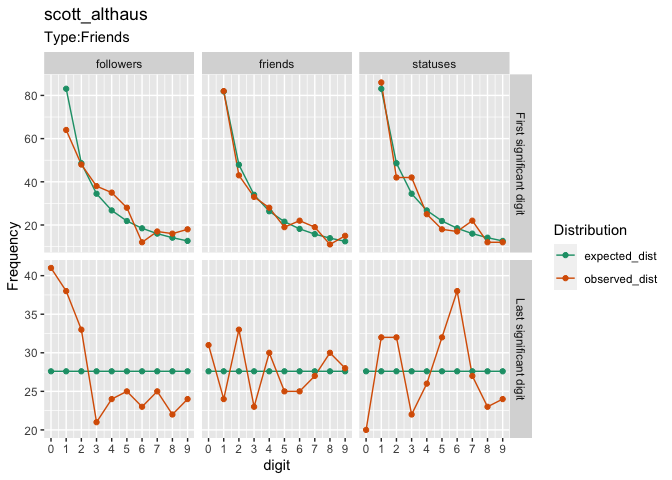
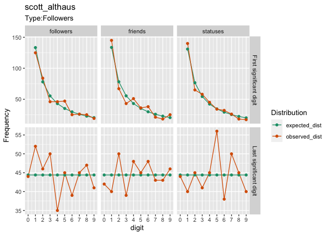
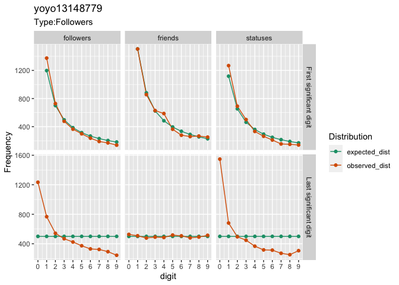

<!-- README.md is generated from README.Rmd. Please edit that file -->

# totervogel 

<!-- badges: start -->

<!-- badges: end -->

The goal of totervogel is to detect malicious twitter accounts using
Benford’s Law.

Please refer to Golbeck (2015) and Golbeck (2019) for more details about
the analysis of first significant digits. For the analysis of last
significant digits, please refer to Dlugosz & Müller-Funk (2009)

1.  Golbeck, J. (2015). Benford’s law applies to online social networks.
    PloS one, 10(8), e0135169. doi:
    [10.1371/journal.pone.0135169](https://doi.org/10.1371/journal.pone.0135169)
2.  Golbeck, J. (2019). Benford’s Law can detect malicious social bots.
    First Monday. doi:
    [10.5210/fm.v24i8.10163](https://doi.org/10.5210/fm.v24i8.10163)
3.  Dlugosz, S., & Müller-Funk, U. (2009). The value of the last digit:
    Statistical fraud detection with digit analysis. Advances in data
    analysis and classification, 3(3), 281.
    [doi:\[10.1007/s11634-009-0048-5](doi:%5B10.1007/s11634-009-0048-5)\](<https://doi.org/10.1007/s11634-009-0048-5>)

## Installation

You can install the development version of totervogel from
[GitHub](https://github.com/) with:

``` r
# install.packages("devtools")
devtools::install_github("chainsawriot/totervogel")
```

## Example

This is how the totervogel of an organic human account looks like. By
default, it analyzes the friends.

``` r
library(totervogel)
res <- create_totervogel("scott_althaus")
res
#> 
#> ── scott_althaus ──
#> 
#> ● Type:Friends
#> ● Total: 276
#> ── First significant digit ──
#> ── Friends
#> Correlation:  0.991 / Chi-sq:  3.513
#> 
#> ── Statuses
#> Correlation:  0.981 / Chi-sq:  6.143
#> 
#> ── Followers
#> Correlation:  0.949 / Chi-sq:  13.892
#> 
#> ── Last significant digit ──
#> 
#> ── Friends
#> Chi-sq:  2.261
#> 
#> ── Statuses
#> Chi-sq:  11.971
#> 
#> ── Followers
#> Chi-sq:  21.174
```

``` r
plot(res)
```



You can also analyze followers.

``` r
res_fol <- create_totervogel("scott_althaus", followers = TRUE)
res_fol
#> 
#> ── scott_althaus ──
#> 
#> ● Type:Followers
#> ● Total: 443
#> ── First significant digit ──
#> ── Friends
#> Correlation:  0.976 / Chi-sq:  11.602
#> 
#> ── Statuses
#> Correlation:  0.99 / Chi-sq:  4.356
#> 
#> ── Followers
#> Correlation:  0.982 / Chi-sq:  8.039
#> 
#> ── Last significant digit ──
#> 
#> ── Friends
#> Chi-sq:  4.562
#> 
#> ── Statuses
#> Chi-sq:  4.833
#> 
#> ── Followers
#> Chi-sq:  5.916
```

``` r
plot(res_fol)
```



A potentially malicious twitter account’s totervogel results might look
like:

(Please don’t visit these accounts.)

``` r
malicious_res <- create_totervogel("badluck_jones")
malicious_res
#> 
#> ── badluck_jones ──
#> 
#> ● Type:Friends
#> ● Total: 5000
#> ── First significant digit ──
#> ── Friends
#> Correlation:  0.953 / Chi-sq:  255.114
#> 
#> ── Statuses
#> Correlation:  1 / Chi-sq:  3.168
#> 
#> ── Followers
#> Correlation:  0.996 / Chi-sq:  27.806
#> 
#> ── Last significant digit ──
#> 
#> ── Friends
#> Chi-sq:  14.336
#> 
#> ── Statuses
#> Chi-sq:  7.7
#> 
#> ── Followers
#> Chi-sq:  6.74
```

``` r
malicious_res2 <- create_totervogel("yoyo13148779", followers = TRUE)
malicious_res2
#> 
#> ── yoyo13148779 ──
#> 
#> ● Type:Followers
#> ● Total: 4998
#> ── First significant digit ──
#> ── Friends
#> Correlation:  0.994 / Chi-sq:  36.329
#> 
#> ── Statuses
#> Correlation:  0.999 / Chi-sq:  67.714
#> 
#> ── Followers
#> Correlation:  0.999 / Chi-sq:  61.181
#> 
#> ── Last significant digit ──
#> 
#> ── Friends
#> Chi-sq:  11.4
#> 
#> ── Statuses
#> Chi-sq:  2724.977
#> 
#> ── Followers
#> Chi-sq:  1613.481
```

``` r
plot(malicious_res2)
```



# Notes

  - In Golbeck (2015), 89.7% of Twitter users had a correction of over
    0.9. Less than 1% had a correlation under 0.5. An account must be
    very suspicious to have such a low correction.

  - Accounts with a lower friends count are more likely to be detected
    with lower Benfordness.

  - The last digit analysis is experimental. The results should only
    raise your eyebrows, if more than one aspect (friends, statuses,
    followers) displays unexpected distribution.

  - The logo of this package is a remix of Kearney et al’s
    [rtweet](https://github.com/ropensci/rtweet)’s logo. The original
    logo is licensed under an MIT License.
